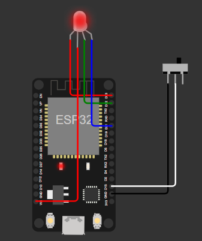
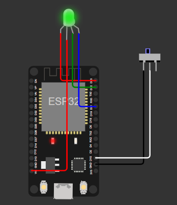
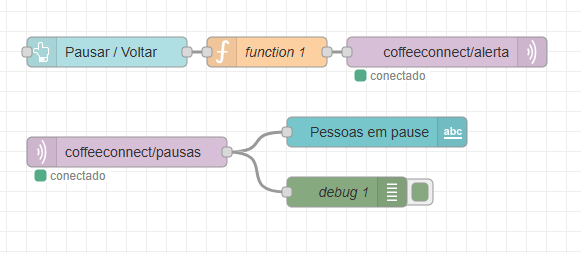
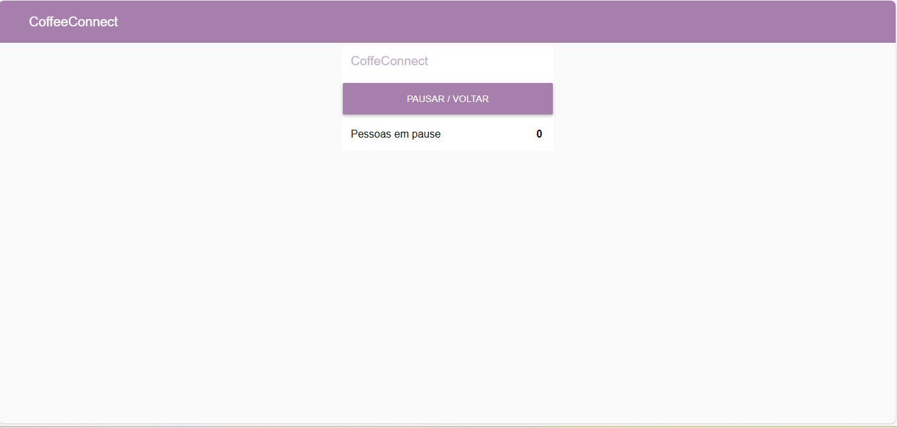

<h1 align="center">☕ CoffeeConnect – Sistema IoT de Monitoramento de Pausas</h1>
<h3 align="center">Projeto desenvolvido pela <strong>Nova Tech Global</strong></h3>

<p align="center">
  
  
  
  
</p>

---

##  <span style="color:#4169E1">Objetivo do Projeto</span>

O **CoffeeConnect** foi criado para monitorar, em tempo real, quantas pessoas estão em **pausa** dentro de um ambiente corporativo.

O sistema utiliza **IoT + MQTT + Node-RED**, permitindo:

- Identificação automática de quando alguém inicia ou encerra uma pausa  
- Controle visual através de um **LED RGB inteligente**  
- Envio das informações para o **Node-RED**, que exibe os dados em um dashboard  
- Representação gráfica do número de pessoas simultaneamente em pausa  

---

##  <span>Tecnologia e Componentes</span>

| Componente            | Função                                                                 |
|------------------------|------------------------------------------------------------------------|
|  **Node-RED**            | Organiza o fluxo, processa os dados e exibe o dashboard              |
|  **ESP32**               | Envia estados de pausa via MQTT                                       |
|  **Botão físico**        | Ativa ou desativa a pausa                                             |
|  **LED RGB**             | Indica o estado atual (ativo, em pausa, limite excedido)              |
|  **MQTT Broker**         | Faz a comunicação entre o ESP32 e o Node-RED                          |
| **Dashboard IoT**       | Mostra gráfico e contador em tempo real                              |

---

##  <span>Como Funciona</span>

### Detecção de Pausa

1. O usuário pressiona o botão físico (modo toggle).
2. O ESP32 identifica mudança de estado e:
   - Incrementa ou decrementa o contador global  
   - Publica o valor atualizado em `coffeeconnect/pausas` via MQTT  

### Iluminação do LED RGB

- **Vermelho** – Sem pausa  
- **Verde** – Usuário está em pausa   

### Node-RED

- Recebe os valores publicados no tópico MQTT  
- Exibe:
  - Contador atual  
  - Gráfico histórico  
  - Estado em tempo real  

---

## <span style="color:#2F4F4F">Interface IoT no Node-RED</span>

O dashboard exibe:

1. **Número atual de pessoas em pausa**   
2. **Fluxo MQTT completamente integrado**

Tudo atualizando automaticamente sempre que o ESP32 envia um novo valor.

---

##  <span style="color:#FF6347">Alertas e Regras do Sistema</span>

| Situação                        | Ação no Sistema                                               |
|--------------------------------|--------------------------------------------------------------|
| Pessoa inicia pausa            |  LED verde + incrementa o contador                           |
| Pessoa encerra pausa           |  LED vermelho + decrementa o contador                           |
| Contador abaixo de zero        |  Sistema corrige para **0** automaticamente                 |
| Dashboard do Node-RED          |  Atualiza instantaneamente                                  |

---

## Demonstração do Funcionamento no Wokwi

<p align="center">
  
  
</p>

<p align="center"><strong>
(TRABALHANDO / PAUSA) por meio do LED RGB.  
A definição do estado é feita pelo próprio funcionário através de um botão.
</strong></p>

## Fluxo no Node-RED

Esta seção apresenta o fluxo responsável por:

- Receber o estado do funcionário enviado pelo ESP32  
- Atualizar o dashboard em tempo real  
- Registrar logs de presença e pausas  
- Integrar o estado do LED RGB com o sistema IoT  

<p align="center">
  
</p>

##  Dashboard IoT

O dashboard exibe em tempo real:

- Funcionários ativos  
- Funcionários em pausa  
<p align="center">
  
</p>


##  Video Do Projeto

<p align="center">
  <a href="https://youtu.be/i3WRpNt7JQE" target="_blank">
    
  </a>
</p>

<p align="center"><strong> Demonstração da Simulação do CoffeeConnect</strong></p>

---

## Código Do Projeto
```cpp
#include <WiFi.h>
#include <PubSubClient.h>

#define BUTTON_PIN 15
#define LED_R 23
#define LED_G 22

const char* ssid = "Wokwi-GUEST";
const char* password = "";
const char* mqtt_server = "test.mosquitto.org";

WiFiClient espClient;
PubSubClient client(espClient);

int estado = 0;
int ultimoEstado = HIGH;
int leitura = HIGH;

void setup_wifi() {
  WiFi.begin(ssid, password);
  while (WiFi.status() != WL_CONNECTED) {
    delay(200);
  }
}

void reconnect() {
  while (!client.connected()) {
    client.connect("CoffeeConnectClient");
    client.subscribe("coffeeconnect/pausas");
    if (!client.connected()) {
      delay(1000);
    }
  }
}

void callback(char* topic, byte* message, unsigned int length) {}

void acende(int r, int g) {
  digitalWrite(LED_R, r);
  digitalWrite(LED_G, g);
}

void setup() {
  pinMode(BUTTON_PIN, INPUT_PULLUP);
  pinMode(LED_R, OUTPUT);
  pinMode(LED_G, OUTPUT);

  acende(HIGH, HIGH);

  setup_wifi();
  client.setServer(mqtt_server, 1883);
  client.setCallback(callback);
}

void loop() {
  if (!client.connected()) {
    reconnect();
  }

  client.loop();
  leitura = digitalRead(BUTTON_PIN);

  if (leitura != ultimoEstado) {
    delay(80);

    if (leitura == LOW) {
      estado = 1;
    } else {
      estado = 0;
    }

    client.publish("coffeeconnect/pausas", String(estado).c_str());
    ultimoEstado = leitura;
  }

  if (estado == 1) {
    acende(HIGH, LOW);
  } else {
    acende(LOW, HIGH);
  }

  delay(50);
}
```
##  Integrantes do Grupo
 | [<br><sub>Gabriel Ciriaco</sub>](https://github.com/Gabsgc01) | [<br><sub>Marco Aurélio</sub>](https://github.com/Arriatea) | [<br><sub>Bernardo Hanashiro</sub>](https://github.com/BernardoYuji) |
| :---: | :---: | :---: |

